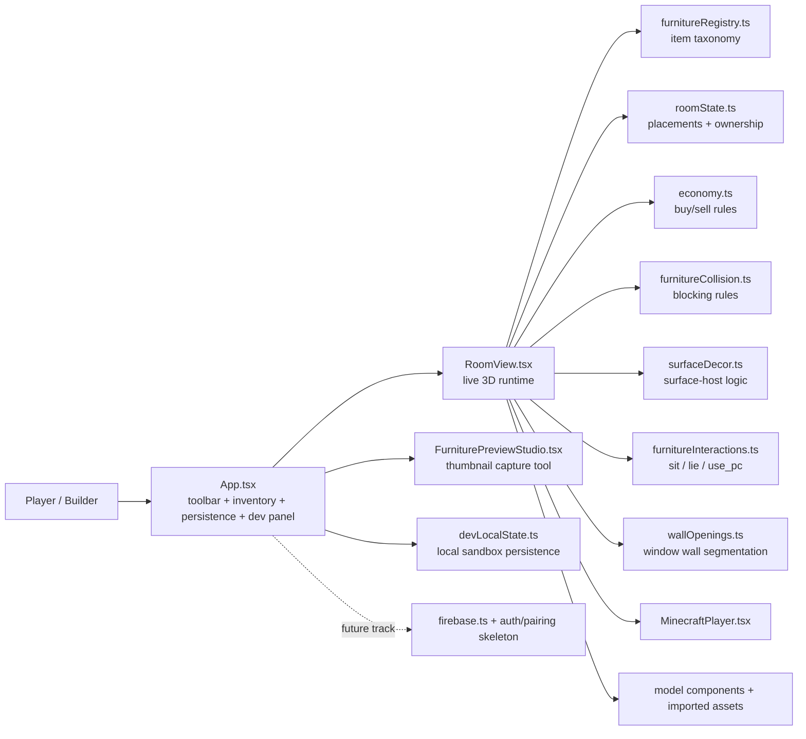
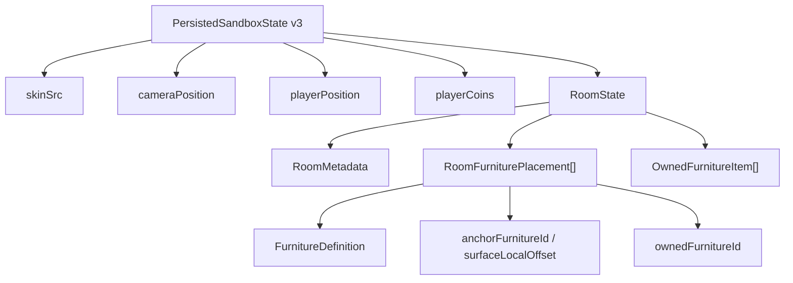
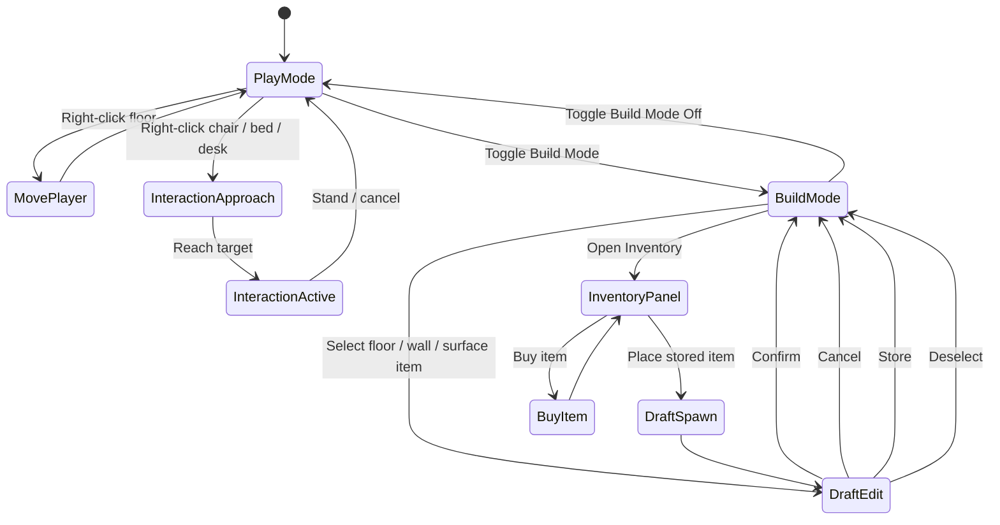
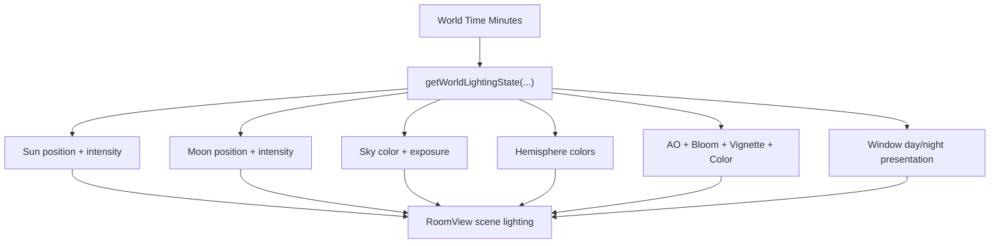
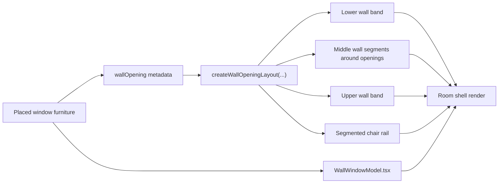
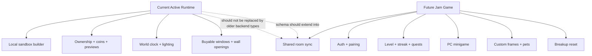

# Diagrams

## Current Runtime Architecture

```mermaid
flowchart LR
  Player["Player / Builder"] --> App["App.tsx<br/>toolbar + inventory + persistence + dev panel"]
  App --> Room["RoomView.tsx<br/>live 3D runtime"]
  App --> Preview["FurniturePreviewStudio.tsx<br/>thumbnail capture tool"]
  App --> Save["devLocalState.ts<br/>local sandbox persistence"]

  Room --> Registry["furnitureRegistry.ts<br/>item taxonomy"]
  Room --> RoomState["roomState.ts<br/>placements + ownership"]
  Room --> Economy["economy.ts<br/>buy/sell rules"]
  Room --> Collision["furnitureCollision.ts<br/>blocking rules"]
  Room --> Surface["surfaceDecor.ts<br/>surface-host logic"]
  Room --> Interactions["furnitureInteractions.ts<br/>sit / lie / use_pc"]
  Room --> Openings["wallOpenings.ts<br/>window wall segmentation"]
  Room --> Avatar["MinecraftPlayer.tsx"]
  Room --> Models["model components + imported assets"]

  App -. future track .-> Firebase["firebase.ts + auth/pairing skeleton"]
```

## Current Data Model

```mermaid
flowchart TD
  Sandbox["PersistedSandboxState v3"] --> Skin["skinSrc"]
  Sandbox --> Camera["cameraPosition"]
  Sandbox --> Player["playerPosition"]
  Sandbox --> Coins["playerCoins"]
  Sandbox --> Room["RoomState"]

  Room --> Meta["RoomMetadata"]
  Room --> Placements["RoomFurniturePlacement[]"]
  Room --> Owned["OwnedFurnitureItem[]"]

  Placements --> Registry["FurnitureDefinition"]
  Placements --> Anchor["anchorFurnitureId / surfaceLocalOffset"]
  Placements --> OwnershipRef["ownedFurnitureId"]
```

## Current Editor Flow

```mermaid
stateDiagram-v2
  [*] --> PlayMode

  PlayMode --> MovePlayer: Right-click floor
  MovePlayer --> PlayMode

  PlayMode --> InteractionApproach: Right-click chair / bed / desk
  InteractionApproach --> InteractionActive: Reach target
  InteractionActive --> PlayMode: Stand / cancel

  PlayMode --> BuildMode: Toggle Build Mode
  BuildMode --> PlayMode: Toggle Build Mode Off

  BuildMode --> InventoryPanel: Open Inventory
  InventoryPanel --> DraftSpawn: Place stored item
  InventoryPanel --> BuyItem: Buy item
  BuyItem --> InventoryPanel

  BuildMode --> DraftEdit: Select floor / wall / surface item
  DraftSpawn --> DraftEdit

  DraftEdit --> BuildMode: Confirm
  DraftEdit --> BuildMode: Cancel
  DraftEdit --> BuildMode: Store
  DraftEdit --> BuildMode: Deselect
```

## Current Lighting Flow

```mermaid
flowchart TD
  Clock["World Time Minutes"] --> Lighting["getWorldLightingState(...)"]
  Lighting --> Sun["Sun position + intensity"]
  Lighting --> Moon["Moon position + intensity"]
  Lighting --> Sky["Sky color + exposure"]
  Lighting --> Hemi["Hemisphere colors"]
  Lighting --> Post["AO + Bloom + Vignette + Color"]
  Lighting --> Windows["Window day/night presentation"]

  Sun --> Scene["RoomView scene lighting"]
  Moon --> Scene
  Sky --> Scene
  Hemi --> Scene
  Post --> Scene
  Windows --> Scene
```

## Window Wall System

```mermaid
flowchart LR
  WindowPlacement["Placed window furniture"] --> OpeningMeta["wallOpening metadata"]
  OpeningMeta --> Layout["createWallOpeningLayout(...)"]
  Layout --> Lower["Lower wall band"]
  Layout --> Middle["Middle wall segments around openings"]
  Layout --> Upper["Upper wall band"]
  Layout --> Rail["Segmented chair rail"]
  WindowPlacement --> WindowModel["WallWindowModel.tsx"]

  Lower --> Shell["Room shell render"]
  Middle --> Shell
  Upper --> Shell
  Rail --> Shell
  WindowModel --> Shell
```

## Current vs Future Boundary

```mermaid
flowchart TD
  Current["Current Active Runtime"] --> Local["Local sandbox builder"]
  Current --> Inventory["Ownership + coins + previews"]
  Current --> Clock["World clock + lighting"]
  Current --> Windows["Buyable windows + wall openings"]

  Future["Future Jam Game"] --> Pair["Auth + pairing"]
  Future --> Shared["Shared room sync"]
  Future --> Progress["Level + streak + quests"]
  Future --> Activities["PC minigame"]
  Future --> Personal["Custom frames + pets"]
  Future --> Breakup["Breakup reset"]

  Current -. schema should extend into .-> Shared
  Current -. should not be replaced by older backend types .-> Shared
```
