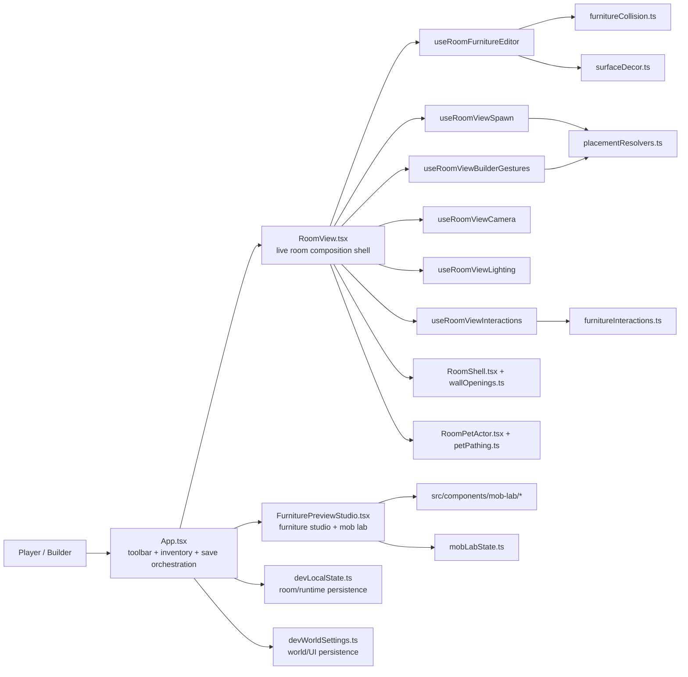
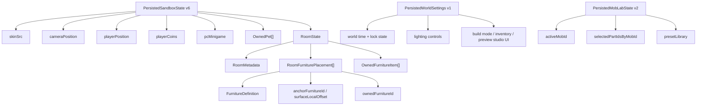
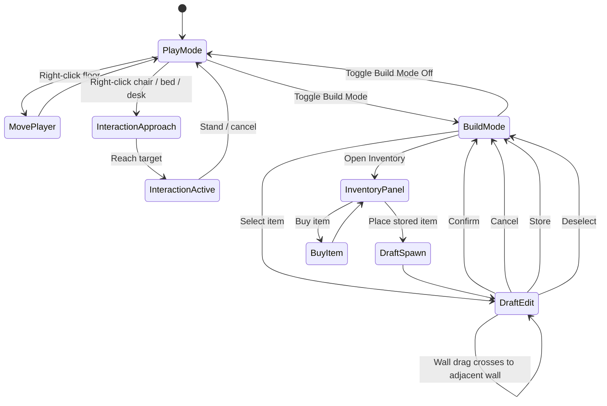
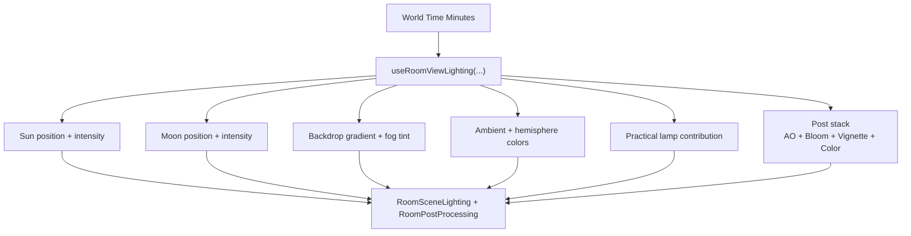
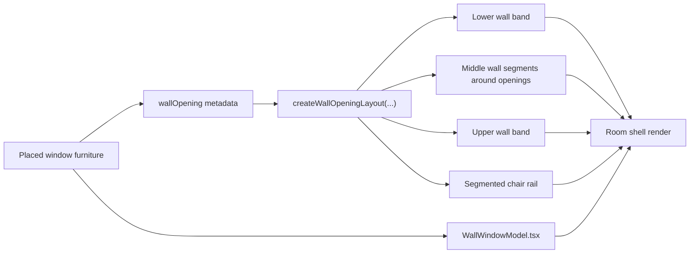
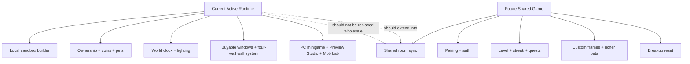

# Diagrams

## Current Runtime Architecture

```mermaid
flowchart LR
  Player["Player / Builder"] --> App["App.tsx<br/>toolbar + inventory + save orchestration"]
  App --> Room["RoomView.tsx<br/>live room composition shell"]
  App --> Preview["FurniturePreviewStudio.tsx<br/>furniture studio + mob lab"]
  App --> Save["devLocalState.ts<br/>room/runtime persistence"]
  App --> World["devWorldSettings.ts<br/>world/UI persistence"]

  Room --> Editor["useRoomFurnitureEditor"]
  Room --> Gestures["useRoomViewBuilderGestures"]
  Room --> Interactions["useRoomViewInteractions"]
  Room --> Camera["useRoomViewCamera"]
  Room --> Lighting["useRoomViewLighting"]
  Room --> Spawn["useRoomViewSpawn"]

  Spawn --> Placement["placementResolvers.ts"]
  Gestures --> Placement
  Editor --> Collision["furnitureCollision.ts"]
  Editor --> Surface["surfaceDecor.ts"]
  Interactions --> Targeting["furnitureInteractions.ts"]
  Room --> Shell["RoomShell.tsx + wallOpenings.ts"]
  Room --> Pets["RoomPetActor.tsx + petPathing.ts"]
  Preview --> MobLab["src/components/mob-lab/*"]
  Preview --> MobState["mobLabState.ts"]
```

## Current Data Model

```mermaid
flowchart TD
  Sandbox["PersistedSandboxState v6"] --> Skin["skinSrc"]
  Sandbox --> Camera["cameraPosition"]
  Sandbox --> Player["playerPosition"]
  Sandbox --> Coins["playerCoins"]
  Sandbox --> Pc["pcMinigame"]
  Sandbox --> Pets["OwnedPet[]"]
  Sandbox --> Room["RoomState"]

  Room --> Meta["RoomMetadata"]
  Room --> Placements["RoomFurniturePlacement[]"]
  Room --> Owned["OwnedFurnitureItem[]"]

  Placements --> Registry["FurnitureDefinition"]
  Placements --> Anchor["anchorFurnitureId / surfaceLocalOffset"]
  Placements --> OwnershipRef["ownedFurnitureId"]

  WorldSettings["PersistedWorldSettings v1"] --> Clock["world time + lock state"]
  WorldSettings --> Lighting["lighting controls"]
  WorldSettings --> Ui["build mode / inventory / preview studio UI"]

  MobState["PersistedMobLabState v2"] --> ActiveMob["activeMobId"]
  MobState --> SelectedPart["selectedPartIdsByMobId"]
  MobState --> Library["presetLibrary"]
```

## Current Editor Flow

```mermaid
stateDiagram-v2
  [*] --> PlayMode

  PlayMode --> MovePlayer: Right-click floor
  MovePlayer --> PlayMode

  PlayMode --> InteractionApproach: Right-click chair / bed / desk
  InteractionApproach --> InteractionActive: Reach target
  InteractionActive --> PlayMode: Stand / cancel

  PlayMode --> BuildMode: Toggle Build Mode
  BuildMode --> PlayMode: Toggle Build Mode Off

  BuildMode --> InventoryPanel: Open Inventory
  InventoryPanel --> DraftSpawn: Place stored item
  InventoryPanel --> BuyItem: Buy item
  BuyItem --> InventoryPanel

  BuildMode --> DraftEdit: Select item
  DraftSpawn --> DraftEdit
  DraftEdit --> DraftEdit: Drag / Pivot / Nudge / Rotate
  DraftEdit --> DraftEdit: Wall drag crosses to adjacent wall

  DraftEdit --> BuildMode: Confirm
  DraftEdit --> BuildMode: Cancel
  DraftEdit --> BuildMode: Store
  DraftEdit --> BuildMode: Deselect
```

## Current Lighting Flow

```mermaid
flowchart TD
  Clock["World Time Minutes"] --> Lighting["useRoomViewLighting(...)"]
  Lighting --> Sun["Sun position + intensity"]
  Lighting --> Moon["Moon position + intensity"]
  Lighting --> Backdrop["Backdrop gradient + fog tint"]
  Lighting --> Hemi["Ambient + hemisphere colors"]
  Lighting --> Lamps["Practical lamp contribution"]
  Lighting --> Post["Post stack<br/>AO + Bloom + Vignette + Color"]

  Sun --> Scene["RoomSceneLighting + RoomPostProcessing"]
  Moon --> Scene
  Backdrop --> Scene
  Hemi --> Scene
  Lamps --> Scene
  Post --> Scene
```

## Window Wall System

```mermaid
flowchart LR
  WindowPlacement["Placed window furniture"] --> OpeningMeta["wallOpening metadata"]
  OpeningMeta --> Layout["createWallOpeningLayout(...)"]
  Layout --> Lower["Lower wall band"]
  Layout --> Middle["Middle wall segments around openings"]
  Layout --> Upper["Upper wall band"]
  Layout --> Rail["Segmented chair rail"]
  WindowPlacement --> WindowModel["WallWindowModel.tsx"]

  Lower --> Shell["Room shell render"]
  Middle --> Shell
  Upper --> Shell
  Rail --> Shell
  WindowModel --> Shell
```

## Current Vs Future Boundary

```mermaid
flowchart TD
  Current["Current Active Runtime"] --> Local["Local sandbox builder"]
  Current --> Inventory["Ownership + coins + pets"]
  Current --> Clock["World clock + lighting"]
  Current --> Windows["Buyable windows + four-wall wall system"]
  Current --> Activities["PC minigame + Preview Studio + Mob Lab"]

  Future["Future Shared Game"] --> Pair["Pairing + auth"]
  Future --> Shared["Shared room sync"]
  Future --> Progress["Level + streak + quests"]
  Future --> Personal["Custom frames + richer pets"]
  Future --> Breakup["Breakup reset"]

  Current -. should extend into .-> Shared
  Current -. should not be replaced wholesale .-> Shared
```
