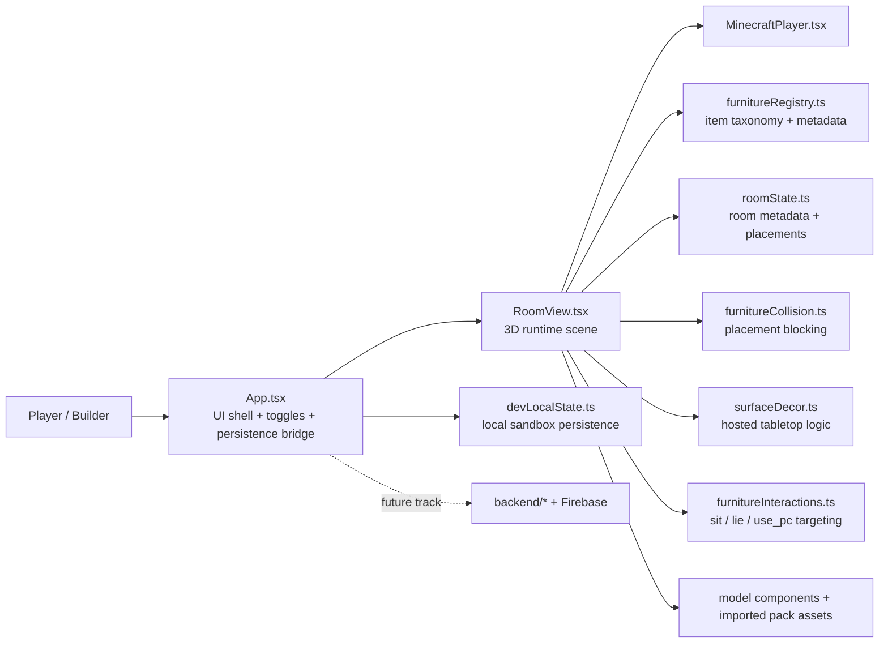
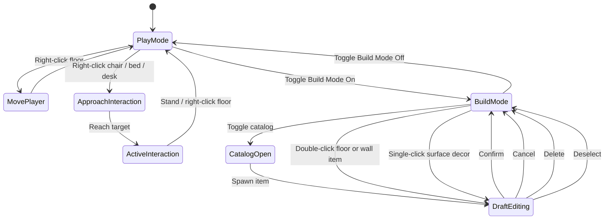
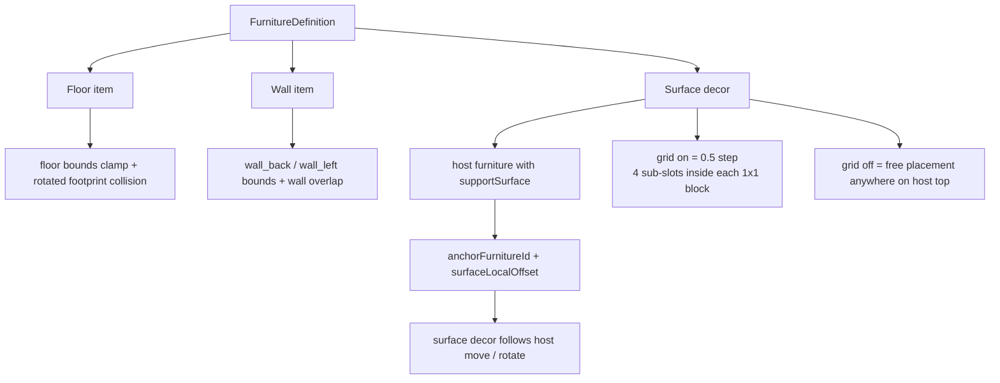
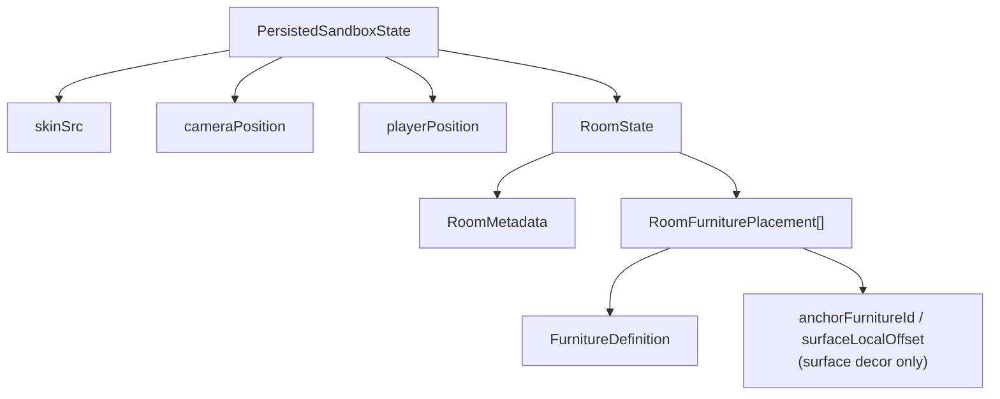
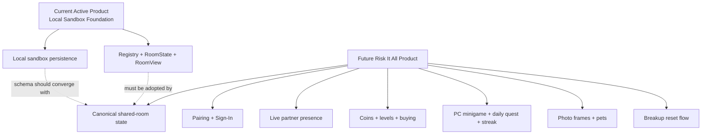

# Diagrams

## Current Runtime Architecture
Current: how the active solo sandbox runtime is structured.

## Current Mode and Interaction Flow
Current: how the player moves between play mode, build mode, and interaction states.

## Placement System Diagram
Current: the three placement families and their rule sets.

## Current Data Model Diagram
Current: the local sandbox save and room model structure.

## Full Product Roadmap Diagram
Future: the intended path from the current sandbox foundation to the jam-ready `Risk It All` experience.

```mermaid
flowchart LR
  A["Current: Local Solo Sandbox Foundation"] --> B["Stabilize Builder + Current Interactions"]
  B --> C["Unify Local Room Schema With Shared Room Model"]
  C --> D["Auth + Pairing + Shared Room Sync"]
  D --> E["Coins + Buying + Levels + Couple Streak"]
  E --> F["One PC Minigame + One Daily Quest"]
  F --> G["Custom Photo Frames + One Pet"]
  G --> H["Breakup Reset Flow + Final Jam Polish"]
```

## Current vs Future Boundary
Future-facing note: backend and auth already exist in the repo, but the active runtime currently stops at the local solo sandbox foundation.

